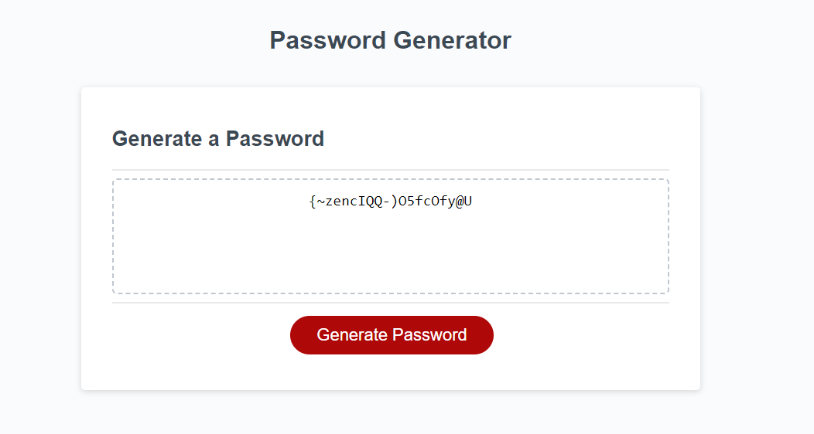

# Random Password Generator
Check out the live app [here](https://pandi1813.github.io/Random-Password-Generator/)

## Table of contents

- [Overview](#overview)
  - [The challenge](#the-challenge)
  - [Screenshot](#screenshot)
- [My process](#my-process)
  - [Built with](#built-with)
  - [What I learned](#what-i-learned)
  - [Continued development](#continued-development)
  - [Useful resources](#useful-resources)
- [Author](#author)


## Overview

### The challenge

To create the JavaScript code for a random password generator that takes user input and creates a password based on the requirements

### Screenshot




## My process

### Built with

- JavaScript functions
- if statements
- for loops
- arrays
- Array methods such as .push(), .concat() and .join()


### What I learned

How to use what we learned about JavaScript to  build a project.
How to combine array methods, functions, if statements and for loops to create a working code.
How to fix bugs in the code using the chrome debugger


```js
// function to prompt the get password requirements
function getPasswordOptions() {

  passwordLength = prompt("How many characters would you like to use?");

  // if statements to set password length limits
  if (passwordLength < 10) {
    return alert("Password too short, please select at least 10 characters");
  };

  if (passwordLength > 64) {
    return alert("Password too long, please select maximum 64 characters");
  }


  addLowerCasedCharacters = confirm("Would you like to use lower cased characters?");
  addUpperCasedCharacters = confirm("Would you like to use upper cased characters?");
  addNumbers = confirm("Would you like to use numbers?");
  addSpecialCharacters = confirm("Would you like to use special characters?");

  selectCharacterTypes();
  generateRandomNumbers();
}

```
```js
function generatePassword() {
  console.log(selectedCharactersArray);

  for (let i = 0; i < passwordLength; i++) {
    generatedPassword.push(selectedCharactersArray[randomNumber[i]]);
    console.log(randomNumber[i]);
  }

  console.log(generatedPassword)
  let stringPassword = generatedPassword.join("");
  console.log(stringPassword)

  return stringPassword
}
```


### Continued development

I want to practice more javascript to solidify the new concepts. To simplify the code as much as possible to make it easier to read


### Useful resources

- Nick Morgan - JavaScript for kids: The relevant chapter helped me a lot to understand the concept
- [MDN documentation](https://developer.mozilla.org/en-US/docs/Web/JavaScript/Reference/Global_Objects/Array/concat) - Specifically the documentation of the array methods helped me a lot to figure out how to use them


## Author
  Andrea Peter

- GitHub - [pandi1813](https://github.com/pandi1813)
